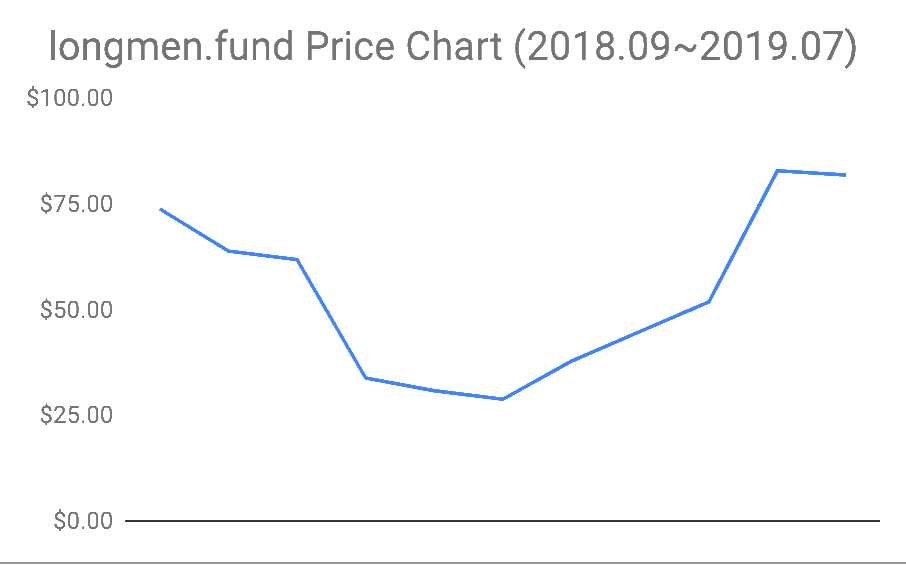
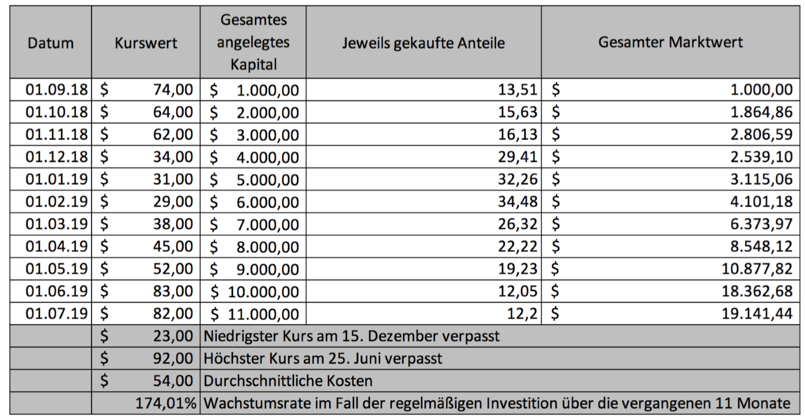
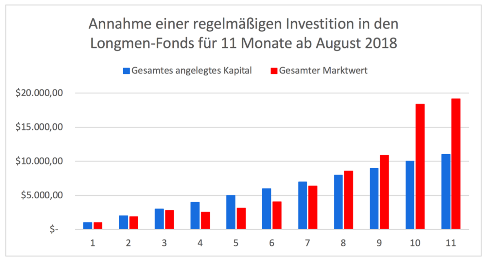

# Regelmäßige Investition — Selbstkultivierung des Erfolgs

*- - Lass die Zeit dich bereichern ......*

Li Xiaolai

Juli 2019

Dieses Buch nicht gelesen haben, wäre für gewöhnliche Menschen ein unendlicher Verlust.

[https://b.watch/]("https://b.watch/")

------

## 3. Die einzige Investitionsmethode für gewöhnliche Menschen ist die regelmäßige Investition

Zuerst die Schlussfolgerung:

> Auf der zauberhaften Börse gibt es **nur eine zuverlässige richtige Investitionsmethode für gewöhnliche Menschen — die regelmäßige Investition.** Das sollst du dir immer merken!

Da [BOX](https://b.watch/), der erste Blockchain-ETF, erst vor kurzem gegründet wurde (Anmerkung: am 3. Juli 2019,dem Black Friday der Bitcoins), reicht seine Statistik noch nicht, um als Beispiel die regelmäßige Investition  als die einzige zuverlässige Investitionsmethode für gewöhnliche Menschen zu erläutern.

Der Vorgänger des Longmen-Fonds (https://longmen.fund) - der Bitfonds - wurde 2013 von mir gegründet und 2018 liquidiert. Ein Teil der Investoren hat entschieden, ihn nach fünf Jahren weiter zu führen und deshalb das ETF-Produkt, den Longmen-Fonds, gegründet. Der Longmen-Fonds ist für die Öffentlichkeit noch nicht zugänglich und können zurzeit nur eine kleine Anzahl von qualifizierten und eingeladenen Menschen die Möglichkeit haben, dieses Produkt zu kaufen. Allerdings hat er eine langfristig offengelegte Statistik und kann hier deshalb als ein Beispiel für den Gegenstand der regelmäßigen Investition dienen.

Hier ist ein Screenshot von der Homepage des Longmen-Fonds Anfang Juli 2019:

Um diese Statistik als ein Beispiel für die regelmäßigen Investition zu verwenden, beobachten wir nur die monatlichen Daten:

Nehmen wir an, du hättest seit September 2018 für 11 Monate regelmäßig jedes Monat 1.000 USD in den Longmen-Fonds investiert, dann wären die Daten ungefähr wie folgt:

Das heißt, in Falle einer regelmäßigen Investition würdest du sowohl den Punkt des höchsten Kurswertes, $ 92 am 25. Juni 2019, als auch den niedrigsten Punkt, $ 23 am 15. Dezember 2018, verpassen. Dennoch wäre dein durchschnittlicher Kaufkurs $ 54 und der aktuelle Kurs wäre ungefähr $ 85. Nach den 11 Monaten hättest du insgesamt $ 11.000 angelegt und du hättest jetzt $ 19.141,44 auf deinem Konto. Der Kurs bei deiner letzten regelmäßigen Anlage wäre $ 82 — das wäre sogar $ 1 niedriger als im letzten Monat. Damit hättest du schon eine Renditenrate von 74,01% erreicht!

Aus der folgenden Grafik kannst du das Verhältnis zwischen deinem Kapital und den derzeitigen Renditen deutlicher ersehen:

Die Statistik des Longmen-Fonds über die 11 Monate ergibt eine faszinierende „Lächel-Kurve“.

Auf dem Handelsmarkt verwendet nur eine Minderheit die Strategie der regelmäßigen Investition, und die „**Lächel-Kurve**“ wird für die, die diese Strategie nicht verwendet, wohl zu entgegengesetzten „**Kurve des bösen Lächelns**“. Dies ist absolut kein freundliches Lächeln, sondern ein böswilliges Lächeln wie beim Joker von „Batman“ — der beim Lächeln auch noch mit seiner schauerlichen Stimme murmelt: „Why so serious? – Warum denn so ernst?“

Schauen wir uns noch mal die Statistik an. Nehmen wir an, wenn du wie die Meisten dein sämtliches Kapital auf einmal anlegen und im September 2018 $ 11.000 investieren würdest, hättest du nach 11 Monaten auch nichts verloren, sondern du hättest eine Rendite von ungefähr **10,81%** erzielt! Das ist zwar viel niedriger als **74,01%**, aber zumindest hättest du keinen Verlust gemacht!

Aber wenn du als Investor, mit einmal mal das ganze Kapital investiert, hättest, wäre es nur unwahrscheinlich, dass du die ganzen 11 Monate durchhalten könntest. Wieso? Denn für diese Investoren ist diese Kurve absolut eine Kurve des bösen Lächelns.

Du würdest nicht nur jeden Monat, sondern jeden Tag und sogar jede Minute von Sorge gequält werden. Innerhalb des ganzen halben Jahres würdest du ein starkes Gefühl haben, dass sich dein Vermögen jede Sekunde verminderte.

Freud und Leid sind nicht von gleichen Maße. Es liegt in unseren Genen den Verlust von 10 Euro als viel schlimmer zu empfinden, als die Freude 10  Euro zu gewinnen. Es fühlt sich an, wie wenn der böse Clown dich quälen, dir die Zunge herausstrecken und spöttisch murmeln würde: Warum denn so ernst?

Wenn du die Methode der regelmäßigen Investition verfolgen würdest, dann befändest du in einer ganz anderen Welt. Diese Welt sieht total gleich aus wie die andere, aber die Meisten können dein Gefühl gar nicht verstehen, weil dein Gefühl das genaue Gegenteil jener anderen Welt ist.

**Die regelmäßige Investition ist eine langfristige Unterstützung.** Da du deine Zukunft mit der Investition verbindest, wirst du dir bei der Auswahl reiflich überlegen. Jede Kurssenkung nach deiner ersten Anlage ist dir eine Chance, deinen durchschnittlichen Kaufkurs zu senken. Während die einmaligen Anleger den kalten Winter erleben, bist du guter Laune und fühlst du dich wegen des niedrigeren Kurses glücklich.

Die einmaligen Anleger können den Schmerz nicht lange ertragen — eigentlich kann kein Mensch Schmerzen lange ertragen. Das hat mit der sogenannten „Willenskraft“ nichts zu tun. Aus einer anderen Perspektive gesehen ist es auch nicht Dummheit, sondern nur Unwissen. Nachdem man für einen, zwei oder drei Monate ausgehalten hat, scheint es, dass man es durchstehen könnte. Aber im sechsten Monat (oder noch früher), werden viele aus unterschiedlichen Gründen aussteigen — das bezeichnet man auf dem Aktienmarkt als „sich ins eigene Fleisch schneiden“... Guck mal, die verlierenden unwissenden Investoren schneiden sich ins eigene, blutende Fleisch.

Und du? Wenn du ein regelmäßiger Investor wärst, dann hättest du gar nichts durchzuhalten, sondern alles würde laufen, wie es eigentlich wolltet. Wenn jemand dich bei einer Kurssenkung verhinderte, weiter zu kaufen, würdest du mit ihm kämpfen möchten — denn laut eines chinesischen Sprichwortes ist das Hindern am Weg zum Reichtum so schlimm wie der Mord an den eigenen Eltern. Wärst du besorgt? Zittertest du vor Kälte? Nein! Du würdest bei jeder regelmäßigen Anlage sehr aufgeregt sein, denn jede Kurssenkung wäre wie eine „**Vorverlegung deines Einstiegs**“. Du würdest nicht wie die unwissenden Investoren bereuen, „Ach je, hätte ich es doch früher gewusst!“ oder „Warum habe ich es erst so spät gewusst!“ Sie denken nur, dass sie zu spät eingestiegen seien. Aber du wärst anders als sie, weil du wüsstest, deine Handlung verlegt deine relative Einstiegszeit dauerhaft nach vorne.

Nach sechs Monaten fängt der Kurs langsam an, wieder anzusteigen... Denkst du, die Leute, die sich ins eigene Fleisch geschnitten haben, würden jetzt noch einmal alles Kapital anlegen? Nein! Sie haben Angst— das furchtbare Erlebnis von zuvor macht sie besonders ängstlich. Was mit der Sicherheit passieren würde, ist, dass sie in ihrem Zögern zuguckten, wie der Kurs steigt. Bei der Kurssenkung sind sie aus Angst ausgestiegen und jetzt haben sie noch größere Angst. Ihre Angst steigert sich bis sie zusammengebrochen sind. Erst wenn der Kurs ziemlich hoch ist und die nächste Kurve des bösen Lächels anfängt, steigen sie wieder ein.

Diese Wiederholung ist für sie furchtbar. Denn egal was sie tun, sie fühlen nur eine böse Welt, die gegen sie agiert. Aufgrund der obigen Erklärung ist es jetzt einfach zu verstehen — denn für sie bestehen die Kurskurven aller Investitionsgegenstände aus unzähligen Kurven des bösen Lächels. Findest du ein derartiges Schicksal nicht furchtbar?

Ist es nicht seltsam, dass die Leute auf derselben Welt total gegensätzliche Gefühle haben? Wenn du die Strategie der regelmäßigen Investition verfolgst, dann ist deine Welt ganz anders. Denn in deinen Augen, bestehen die Kurskurven aus unzähligen Lächel-Kurven! Glück kommt auf dieser Welt sehr selten vor. Ist dieses unsagbare Glück nicht umso seltener und wertvoller?