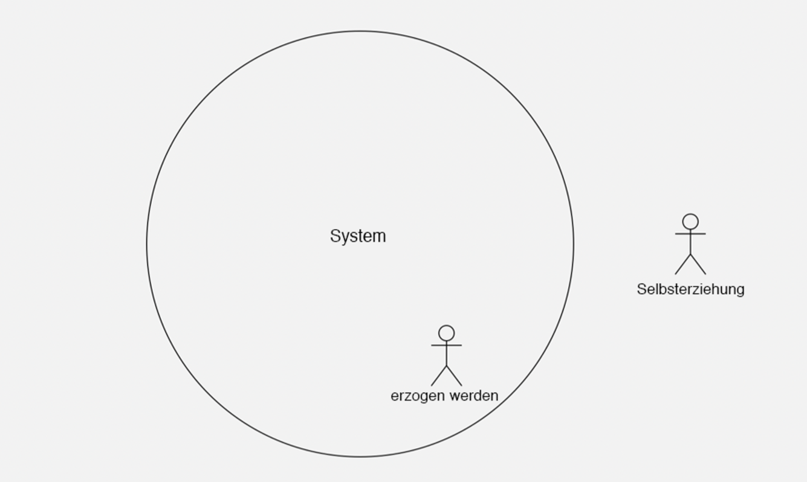
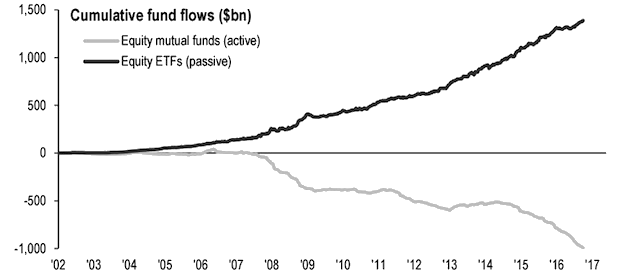

# Regelmäßige Investition — Selbstkultivierung des Erfolgs

*- - Lass die Zeit dich bereichern ......*

Li Xiaolai

Juli 2019

Dieses Buch nicht gelesen haben, wäre für gewöhnliche Menschen ein unendlicher Verlust.

https://b.watch/

----

### 9.6 Wie stark die dem Trend entsprechende passive Kraft ist

Zuerst ein Beispiel aus der anderen Perspektive: Die sogenannte **Bildung** ist ein hervorragendes Beispiel dafür, wie die passive Kraft negativ wirkt.

Generationen von Menschen haben sich über das Scheitern der Bildung beklagt: nicht nur über ihr Versagen, sondern auch über das Scheitern der gesamten Bildungsgemeinschaft. Es passiert nicht nur in China, sondern weltweit reflektieren die Menschen immer wieder über ihre sogenannte Bildung. Aber wenn du andersrum denkst, wirst du die entgegengesetzte Erklärung finden:

> Tatsächlich ist die Bildung zu jeder Zeit, in jedem Land, außerordentlich erfolgreich!

Wie kann man zu so einer Schlussfolgerung kommen? Weil die Bildung von uns aus diesem Aspekt definiert wird:

> **Die sogenannte Bildung bezeichnet im Wesentlichen die Formung des Menschen im Hinblick auf den Wunsch, wie das System ein Individuum schaffen möchte.**

Jeder befindet sich in einer Reihe von ineinandergreifenden Systemen bezüglich unserer Kreise, unserer Kultur, unserer Gesellschaft, unseres Lands, unserer Welt und so weiter. Dies sind „bereits sehr entwickelte Systeme“. Lass dich nicht davon täuschen, dass sie nur objektiv existiert. Tatsächlich leben diese Systeme sogar mit Seelen. Sie haben eine gottgleiche Macht.

In jedem System gibt es Profitierende und Nicht-Profitierende; die Profitierenden sind extrem wenige, dagegen sind die Nicht-Profitierenden die überwiegende Mehrheit. Infolgedessen ist das Ziel der Bildung klar, und die Profitierenden werden die Bildung absichtlich für ihre eigenen Zwecke benutzen, um sie für sich selbst noch vorteilhafter zu machen. Ohne dass ich es dir sagen müsste, weißt du bestimmt was sie tun werden! Nicht-Profitierende werden bald feststellen, dass die Ungleichheit der Macht im Prozess der Konfrontation ist, sodass sich die überwiegende Mehrheit den Profitierenden zuwendet und die wenigen sich immer noch widersetzenden Nicht-Profitierenden werden irgendwann beseitigt. Falls ihr Widerstand erfolgreich ist, können sie sofort selbst die Profitierenden werden und eröffnen das nächste "neue" System, das nur ihnen dient. Die Tatsache verändert sich nicht, so dass es völlig unnötig ist, sich über die Realität zu beschweren. Ist es nicht überall auf der Welt so?

Daher ist die sogenannte Bildung nur wie folgt definiert:

> **Bildung ist, dass das System, in dem du dich befindest, dich in die vom System gewünschte Form bringt.**

Falls die Bildung so definiert wird und die Realität tatsächlich so ist, dann ist die Schlussfolgerung offensichtlich: Jede Bildung in der Geschichte war außergewöhnlich erfolgreich. Sie wird immer erfolgreicher. Nach dieser Sichtweise ist das Versagen der Bildung, über das sich die Menschen beschweren, im Wesentlichen nichts anderes als das Unbehagen der Nicht-Profitierenden am System.

Haben die gewöhnlichen Menschen einen Ausweg? Es gibt einen.

Wenn Bildung wie oben definiert wird, wie sollte das **Selbstlernen** definiert werden?

> **Wenn Bildung die Formung danach, was dieses System von Ihnen verlangt, bezeichnet, dann ist Selbstlernen im Gegensatz dazu das, was Sie sein möchten.**

Daher sind die genaueren Bezeichnungen folgende in enger Beziehung stehende Begriffe:

> - erzogen werden
> - Selbsterziehung

Die überwiegende Mehrheit der Menschen fühlt sich während des Bildungsprozesses (das heißt des Prozesses der Assimilation durch das System) äußerst unwohl - dies ist natürlich. Die nächste Wahl ist jedoch die, die die Stärke des Kampfes am besten widerspiegelt: Die meisten Menschen geben die Ausbildung auf, und nur eine sehr kleine Anzahl von Menschen entscheidet sich für die Selbsterziehung, sie werden autodidaktische Menschen, nicht nur von Zeit zu Zeit, sondern für das ganze Leben. Auffällig ist, dass du nach sorgfältiger Betrachtung der Geschichte feststellen wirst, **dass Menschen, die die Welt verändern, ausnahmslos Autodidakten sind.**

Auf der anderen Seite, egal ob es sich um gebildete Menschen oder Menschen, die das Bildungssystem aufgegeben haben, handelt, werden sie letztendlich vom System assimiliert – die passive Kraft hat einen sehr starken Einfluss auf sie ausgeübt, dieser ist so mächtig, dass niemand etwas tun kann, und letztendlich denkt, es sei eine Art übermenschliche Kraft.

Es gibt eine Filmreihe mit dem Titel "Jahr für Jahr", die 1999 produziert wurde. Ich schlage vor, du nimmst dir die Zeit, sie sich anzuschauen. Die Geschichte beginnt 1978 und jede Episode erzählt ein ganzes Jahr, insgesamt 21 Folgen. Es gibt eine Rolle in der Geschichte des Kinoprojektionspersonals, daher kann jede Episode einen Film des Jahres erwähnen. Darüber hinaus hat jede Folge ein Lied des Jahres, und was noch wichtiger ist, jede Folge erinnert dich an eines der wichtigsten Ereignisse des Jahres. Die Geschichte ist nicht besonders gut, aber sie kann dich wirklich dazu bringen zu fühlen, wie klein jeder Einzelne in einem System ist und wie mächtig die Faktoren sind, denen man sich nur passiv stellen kann.

Die Stärke der negativen Kräfte, denen wir nur passiv begegnen können, und gleichzeitig ihre positive Kraft, ist ebenso mächtig. Schauen wir uns ein Beispiel für die passiven positiven Kräfte an, die mit uns verbunden sind und eine große positive Rolle spielen.

Im Bereich des Fondsmanagements werden Fonds in zwei Arten unterteilt: **aktive Fonds** und **passive Fonds.**

Die obige Grafik zeigt die weltweiten Kapitalzuflüsse von aktiven und passiven Fonds in den letzten Jahren. Warum bevorzugt das Kapital zunehmend passive Fonds? Warum werden aktive Fonds zunehmend abgelehnt? Das Kapital ist sich der Macht der Passivität immer mehr bewusst.

Aktive Fonds erfordern einen einmaligen Manager, der den Markt analysiert und dann ein Portfolio auswählt, das den Markt übertreffen kann. Basierend auf den Erwartungen dieser Manager müssen Anleger eine sehr hohe Verwaltungsgebühr und -aktie zahlen und auch die Transaktionskosten für den häufigen Handel dieser Manager tragen. Im Gegensatz dazu machen passive Fonds keine Werbung für ihre analytischen Fähigkeiten, betreiben keine häufigen Operationen, sondern folgen passiv einem repräsentativen Index wie dem S&P 500.

Fragen zu Fondsmanagern sind seit vielen Jahren keine Seltenheit mehr. Einige Leute witzelten sogar, dass man Aktien in ein Haus wirft, einen Affen hineinsteckt und nach einer Weile die Aktien, auf die vom Affen uriniert wurde, heraussucht um ein Portfolio zu bilden, und das Endergebnis dem der aktiv gemanagten Fonds überlegen ist.

Ist das wahr oder ist es wirklich nur ein Witz? Was du verstehen musst, ist, dass die Geschichte des modernen Wertpapierhandels nicht lange gewachsen ist. Der wirklich moderne Wertpapiermarkt entstand erst in den 1970er Jahren. Die Menschen haben nur vier Phänomene auf dem Wertpapiermarkt. Nur ca. 50 Jahre Daten stehen für eine effektive Forschung zur Verfügung.

Laut [Wall Street Journal]("https://www.wsj.com/articles/indexes-beat-stock-pickers-even-over-15-years-1492039859" )(13. April 2017) lagen zum 31. Dezember 2016 insgesamt 95,4% der mittelgroßen Fonds hinter S&P MidCap 400 und 93,2% der kleinen Fonds 15 Jahre hinter der Wertentwicklung zurück. Bei S&P SmallCap 600 bleiben 92,2% der großen Fonds hinterS&P 500 zurück.

Die Fans der aktiven Fonds haben einen scheinbar vernünftigen Einwand. Sie glauben, dass immer mehr Geld in passive Fonds fließt, was die Strategie letztendlich in einen „folgenden Strom“ verwandeln wird, der das aktive Fondsmanagement relativ vorteilhafter macht. Langfristige Anleger verstehen jedoch, dass kurzfristige Veränderungen des Marktes oder ein neuer Trend aktiven Fondsmanagern einen kurzfristigen Vorteil verschaffen, der jedoch von den auf 15 Jahren basierenden Statistiken von langfristigen Anlegern ignoriert werden kann.

Der interessanteste Teil dieser Statistik ist die Schlussfolgerung:

> - Je länger der Investitionszyklus ist, desto größer ist der passive Vorteil;
> - Je höher der Investitionsbetrag, desto größer der passive Vorteil.

Meine persönliche Erfahrung in der Vergangenheit hat mir das bestätigt.

Im Jahr 2013 begann ich mit der Verwaltung eines frühen Fonds, der besonders klein war und in Projekte im Zusammenhang mit dem Bitcoin investierte. Bis 2018, das heißt, 4-Jahres-Management Periode plus ein Jahr Verwertungszeitraum, nach insgesamt fünf Jahren war der Marktwert des Fonds etwa das 68-fache des Startwertes. Dies mag sehr beeindruckend klingen, aber in Wirklichkeit ist es ziemlich entmutigend - weil dieses Ergebnis die Gewinne des Bitcoins nicht übertraf. Mit anderen Worten, wenn all das Geld verwendet worden wäre, um Bitcoins zu kaufen, und die nächsten fünf Jahre, nichts zu tun, wäre es das 58-fache. Das Endergebnis wäre also nicht viel schlechter als das jetzige Ergebnis. Natürlich bin ich ein Fonds und daher ist die Rendite der Anlegers nach Abzug der Gebühr von 30% nur etwa das 48-fache, geringer als das Wachstum des Bitcoins selbst.

Und noch ein weiterer entmutigender Aspekt. Die fünf Jahre mit diesem Fonds waren, wenn auch wenn das nicht erwähnenswert ist, mühsam, und sicherlich spannend - mehrmals fast ausgelöscht, und schließlich mit großem Glück den Comeback geschafft, neun Leben wie eine Katze......in diesem Prozess, ist es sehr wahrscheinlich, dass der Fonds scheitert, tatsächlich wäre es normal, insbesondere in der Blockchain-Welt, wo die Amplituden der Schwankungen um ein Vielfaches größer sind als an der traditionellen Börse.

Nicht zu scheitern ist außergewöhnlich, tatsächlich ist es eine außergewöhnliche Überraschung. Als der Bit-Fonds schließlich liquidiert wurde, hatte ich das Gefühl, dass ich im nächsten Schritt nur noch ein passiver Fonds sein könnte. Es gab überhaupt keine andere Wahl. Nach mehr als einem Jahr des Nachdenkens entwarf ich schließlich [BOX](https://b.watch/), ein Open-Source-Blockchain-ETF-Fondsprodukt. Die aktuelle Broschüre spiegelt den Prozess der Erstellung meines idealen passiven Fondsmodells wider.

Nachdem das gesagt ist, konzentrieren wir uns zunächst auf den Schwerpunkt dieses Abschnitts.

Wenn du darüber nachdenkst, kann dieselbe Schlussfolgerung, die für Personen gilt, hier direkt angewendet werden:

> - Je mehr Ambitionen vorhanden sind, desto mehr passive Kräfte werden benötigt.
> - Je mehr Energie man hat, desto mehr passive Energie benötigt man ...

Die passive Kraft ist nicht nur großartig, **sondern je mehr Zeit vergeht desto schwerer zu übertreffen.**

Sobald passive Kräfte ausgelöst werden, sind sie unvergleichlich stark. Die **Aktivität löst jedoch passive positive Kräfte und passive negative Kräfte aus**. Es heißt also, dass nur aktiv und passiv die optimale Strategie ist.

Darüber hinaus hast du in Bezug auf „den Fluss der Dinge“ möglicherweise neue Erkenntnisse:

> - Es ist definitiv falsch, kurzfristige Ergebnisse mit dem Trend zu beobachten; 
>
> - Langfristige Ergebnisse sind wahrscheinlich die einzig richtige Wahl für den großen Trend ...

Du schaust, selbst wenn jeder denkt, dass er ein Wort versteht, "folge dem großen Trend", wirst du nach ein wenig ernstem Nachdenken unterschiedliche, sogar diametral entgegengesetzte Schlussfolgerungen ziehen.