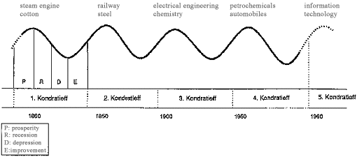
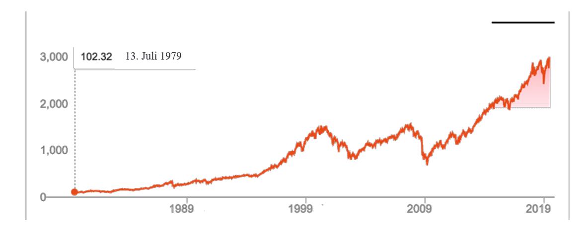

# Regelmäßige Investition — Selbstkultivierung des Erfolgs

*- - Lass die Zeit dich bereichern ......*

Li Xiaolai

Juli 2019

Dieses Buch nicht gelesen haben, wäre für gewöhnliche Menschen ein unendlicher Verlust.

https://b.watch

----

## 13. Die wichtigste gute Nachricht: Für gewöhnliche Menschen bedeutet langfristig nicht für immer

Wenn eine gewöhnliche Person Buffett zuhört wie er sagt: "**Meine Zukunft ist für immer**", werden die Person mehr oder weniger verzweifelt sein, egal sie sich auf welcher Seite der gespiegelten Welt befindet. Das verzweifelte Gefühl kommt nicht aus dem Zweifel über das was Buffett gesagt hat, sondern es kommt aus der Schade oder dem Schmerz: 

> Warum habe ich es erst jetzt gewusst ! (Oder, wenn ich es früher gewusst hätte, wäre es gut!)

Insbesondere, wenn wir daran denken, dass Warren Buffet mit elf Jahren die erste Aktie seines Lebens gekauft hat und schon in jungen Jahren die Gelegenheit hatte Benjamin Graham, den Vater des Value-Investings, zu fragen ob er ihm dieses lehren könnte. Uns mit anderen zu Vergleichen ist ein menschlicher Instinkt, sobald dieser Instinkt einsetzt, wird die Verzweiflung überwältigt sein und jeder fühlt sich hoffnungslos!

Aber das ist nicht der Fall - es ist nur eine sehr befreiende Schlussfolgerung, aber ich muss das dir ganz langsam demonstrieren.

Folgendes wird definitiv viele gewöhnliche Menschen glücklich machen:

> **Jede Generation verdient mehr Geld als die Vorgängergeneration.**

Und nicht nur ein bisschen mehr, sondern deutlich mehr. Dies ist nicht auf die Inflation zurückzuführen, wie viele scherzen. Der Grund für dieses Phänomen ist einfach und klar, denn die menschliche Gesellschaft entwickelt sich, Wissenschaft und Technologie schreiten voran und die Wirtschaftsmodelle verbessern sich...Dies ist die Dividende der Zeit, und die Dividenden dieser Ära sind theoretisch inklusiv, d.h. jede Generation jeder auf der Welt sollte Zugang dazu haben oder zumindest die Möglichkeit haben, die Dividende dieser Ära zu erhalten.

Einfach gesagt, als Buffett elf Jahre alt war, gab es noch keine Firma wie Apple, die die Billionengrenze erreichen konnte. Apples Marktkapitalisierung hat eine Billionen Dollar überschritten und ist damit ein spektakulärer Meilenstein in der Geschichte der menschlichen Wirtschaft. Zuvor gab es noch nie eine Design- und Produktionsfirma für Konsumgüter, die in der Lage war, ihre Produkte auf einem so hohen Niveau weltweit zu verkaufen, dass sie lange Bestand hatten. Auf der Makroebene ist dies das Ergebnis der kontinuierlichen Entwicklung des Geschäfts in der menschlichen Gesellschaft und der zunehmenden wirtschaftlichen Ausdehnung.

Jede Generation hat ein eigenes Verständnis von der Obergrenze. Buffett kämpfte so lange, bevor er Apples Aktien kaufte, was im Grunde seine Fähigkeitsgrenze ist - ganz zu schweigen von Bitcoin, Blockchain. In Buffetts theoretischem System und kognitiven Grenzen, sogar Google, Netflix und Amazon könnte er nicht verstehen. Theoretisch hat jede Generation die Grenzen jeder Generation, einschließlich der jüngeren Generation. Mit der Zeit wird die Erforschung ihrer eigenen aktiven Grenzen ein Ende haben, nicht weil sie nicht vorankommen wollen, sondern es reicht schon. Es kommt von einer anderen Motivation, die von der Wirtschaftstheorie gestützt wird. Natürlich wird die nächste Generation daher zwangsläufig mehr Grenzerforschung betreiben.

Es gibt jedoch noch eine andere Grundlage als die oben genannten Gründe, die die gewöhnlichen Menschen sich noch befreiter fühlen lässt:

> **Die Dauer der Konjunkturzyklen verkürzt sich allmählich.**

Warum kann die menschliche Entwicklung, einschließlich der Entwicklung der Wirtschaft, nicht stetig ansteigen, warum muss sie immer auf und ab springen? Kann sie nicht so beständig sein wie ich?

Woher kommen diese Schwankungen? Vielleicht hast du einen Begriff gehört, der als "Kondratieff" bezeichnet wird, an den vollständigen Namen, kann ich mich nie erinnern, jedes Mal muss ich das in Google suchen und dann auf Wikipedia kopieren um dann: **"Kondratieff-Zyklus**“ zu erhalten. Dieser Russe "Kondratieff" war der erste, der den großen Zyklus studiert hat. Der sogenannte Kondratieff ist eine Art Konjunkturphänomen mit einem Zyklus von etwa 50 bis 60 Jahren. Im Allgemeinen ist diese lange Welle in zwei Phasen unterteilt, die ansteigende A-Phase und die abfallende B-Phase.

Das obige Bild erklärt die Mängel der weltwirtschaftlichen Trends im Rahmen der Theorie der langen Wellen.

Die Bedeutung dieser Kondratieff-Theorie ist für die praktische Anwendung von Wissenschaftlern immer zu unklar und zu schwer zu quantifizieren, deshalb wird sie von der akademischen Gemeinschaft nicht zu sehr geschätzt. Jetzt ist die Kondratieff-Theorie nur der theoretische Eckpfeiler vieler unorthodoxer Wirtschaftswissenschaften.

Dies hat jedoch keinen Einfluss auf die einfachen Fakten, die wir daraus verstehen können:

> - Ein Anstieg, ist kein Trend, ein Rückgang ist auch kein Trend.
> - Ein Anstieg plus ein Rückgang bilden einen Zyklus.
> - Es braucht mindestens zwei Zyklen, um den Trend beurteilen zu können ...

Nach zwei Zyklen können die beiden Schwankungen nur eine von drei Arten von Trends sein: steigend, horizontal oder fallend.

Und wenn wir uns den globalen Aktienindex-Kursverlauf der letzten vier Jahrzehnte ansehen, sehen wir den allgemeinen Aufwärtstrend des Zyklus vieler steigender und fallender Zyklen.

Wenn wir den Preistrend von Bitcoin oder den Preistrend der gesamten Marktkapitalisierung von digitalen Blockchain-Assets betrachten, ist es der gleiche Aufwärtstrend, der durch eine Reihe von Zyklen von Anstieg und Abfall verbunden ist.

Warum dauerte die Erholung von der Weltwirtschaftskrise in den 1930er Jahren so lange (der Grund ist, dass ein Zyklus abgeschlossen war) und warum dauerte die Erholung von der asiatischen Finanzkrise der 1990er Jahren dann nur ein paar Jahre? Warum wird die durch die US-amerikanische Subprime-Hypothekenkrise ausgelöste weltweite Wirtschaftskrise in diesem Jahrhundert noch schneller behoben?

Der Grund ist sehr einfach und unkompliziert, jeder kann es verstehen:

> Der schnelle Informationsfluss macht die globalisierte Zusammenarbeit kohärenter und einfacher. Obwohl Krisen weiterhin auftreten, wird die Erholungsgeschwindigkeit daher immer schneller.

Anders ausgedrückt, **die Bildung des Wirtschaftskreislaufs wird im Wesentlichen durch kurzzeitige Koordination und kurzzeitige Inkonsistenz bei der Zusammenarbeit zwischen mehreren Parteien verursacht.** Wenn die Kommunikationseffizienz von mehreren Parteien (wirklich viele Parteien, es ist unmöglich zu wissen, wo die anderen Nodes sitzen) immer höher wird, folgt die Dauer des Zyklus, in dem er immer kürzer wird, obwohl Schwankungen, d. h. gelegentliche Inkonsistenzen zwischen mehreren Parteien, niemals entfernt werden können.

Dies ist auch der Hauptgrund, warum der Fluktuationszyklus von digitalen Blockchain-Assets relativ kurz ist. In den letzten acht Jahren habe ich immer gehört, das sich die Anzahl der durch Bitcoin-Mining gewonnenen Bitcoins halbiert hat, d. h. vier Jahre, als Grundlage für die Beurteilung des Zyklus. Vielleicht war das früher noch so, aber dieses Urteil verliert allmählich seine Bedeutung, da der Marktwert von Bitcoin nicht mehr der Gesamtmarktwert der digitalen Blockchain-Assets ist.

Ich glaube, dass der Fluktuationszyklus von digitalen Blockchain-Assets im Allgemeinen kürzer ist als der Börsenzyklus, und der Hauptgrund für den immer kürzer werdenden Fluktuationszyklus ist, dass die Effizienz der Mehrparteien-Koordination auf dem Blockchain-Markt offensichtlich höher ist. Ich verstehe aus dieser Sicht, dass es nur wenige einflussreiche Aktienmärkte auf dem Planeten gibt, und auf dem Blockchain-Markt? Wenn du zu coinmarketcap gehst, wirst du wissen, dass es Tausende von Transaktionen gibt, die 24 Stunden am Tag und 365 Tage im Jahr stattfinden. Sagst du, dass die Effizienz der Marktkoordinierung weit über dem traditionellen Börsenmarkt liegt?

Der Kreislauf schrumpft. Was bedeutet diese einfache und verlässliche Schlussfolgerung für gewöhnliche Menschen? Einfach ausgedrückt ist:

> **Das sogenannte "für immer" wird verkürzt.**

„Für immer“ wird immer kürzer, wird „Langfristigkeit“ noch zu lang sein?

Was bedeutet Langfristigkeit? Meiner Meinung nach bedeutet die sogenannte Langfristigkeit für gewöhnliche Menschen lediglich „**nach mindestens zwei großen Zyklen**“. Im Gegensatz dazu bedeuten drei große Zyklen schon soviel wie Warren Buffets Ewigkeit. Wie lange dauern jene zwei großen Zyklen? Der aktuelle große Zyklus von Blockchain und digitalisierten Anlagen dauert nun schon etwa drei bis fünf Jahre, also werden innerhalb von etwa sieben Jahren mit großer Wahrscheinlichkeit zwei Zyklen verstrichen sein. Hierbei gilt es zu beachten, dass der Schwerpunkt **auf den zwei Zyklen** und nicht auf den sieben Jahren liegt.

Wie kann man große Zyklen voneinander unterscheiden? Das ist sehr einfach, man sucht einfach nach den Höhepunkten in der Geschichte der letzten Jahre und betrachtet diese als Anfangspunkt der letzten B-Phase ( d.h. der letzten Abwärtsbewegung); und von da an bis zum höchsten Punkt nach diesem Fall. Das ist dann nach dem Ende der B-Phase und der darauffolgenden A-Phase (d.h. der Anstiegsphase). Damit beginnt der nächste Zyklus. So funktioniert dieser Kreislauf.

Es gilt zu beachten, dass für jeden Menschen nur der Beginn der B-Phase eines solchen großen Zyklus bekannt sein kann, da dort der letzte bekannte Höhepunkt liegt. Wann endet die B-Phase? Sie endet zeitgleich mit dem Beginn der A-Phase. Aber wann endet die A-Phase? Es ist zum jeweiligen Zeitpunkt weder möglich noch nötig dies zu beurteilen. Es zu beurteilen hat auch keinen Nutzen, da es sich lediglich um einen Zyklus handelt. Aber nach dem Ende von zwei Zyklen ist es offensichtlich, dass diese vergangen sind.

Zu jenem Zeitpunkt können Sie nach Belieben Ihre Anlagen halten oder versuchen sie ganz oder teilweise zu veräußern. Ihr jetziges Ich kann sich Ihr zukünftiges Ich nicht vorstellen, aber Ich kann Ihnen aus Erfahrung sagen, dass Ihre größte Veränderung genau wie bei allen anderen Menschen, die wirklich etwas erreichen sein wird:

> **Eine nie zuvor dagewesene Gelassenheit.**

Sie sind ein gewöhnlicher Mensch, wie lang ist langfristig für Sie? Ich habe Ihnen bereits erzählt, mehr als zwei große Zyklen. Gerade das ist der Grund dafür, dass wir als gewöhnliche Menschen digitale Blockchain-Anlagen auswählen, warum wir regelmäßig in BOX investieren, letztlich, weil diese zwei großen Zyklen tatsächlich sehr kurz sind. Insbesondere in der nahen Zukunft, nach diesen zwei Zyklen werden Sie zurückblicken und meine Worte wirklich verstehen.

Keine Sorge, denn diese sogenannte lange Frist ist tatsächlich gar nicht so lang.